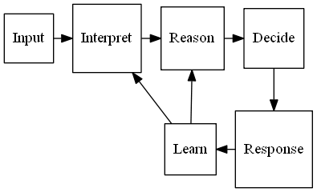
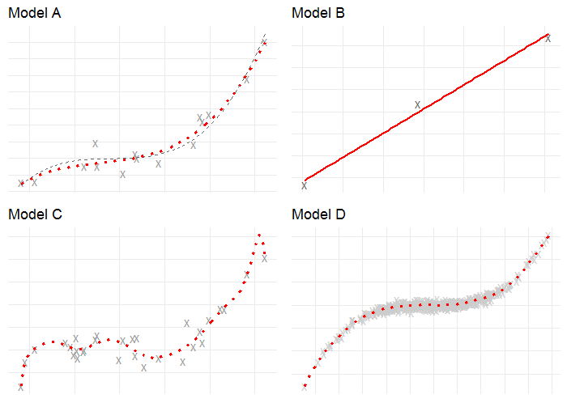
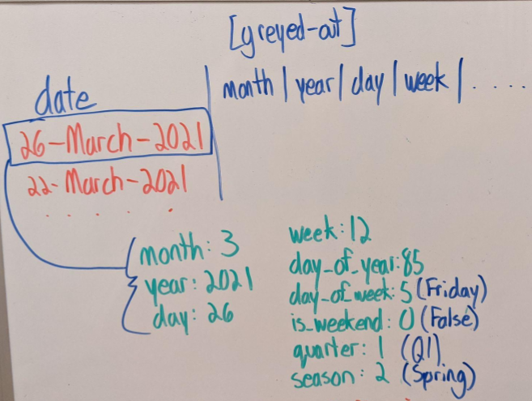

## Artificial Intelligence and Machine Learning

The field of Artificial Intelligence has been around since the 1950s ([!Dartmouth Conference, 1956](http://jmc.stanford.edu/articles/dartmouth/dartmouth.pdf)). It is a broad topic which encompasses a number of sub-fields including but not limited to: Logic, Probability, Knowledge Representation, and Machine Learning.

This figure shows how a system based on Artificial Intelligence might function:

The system accepts an input, performs some inference about what the input represents, performs some reasoning about the inferences made based on prior knowledge, and finally decides on an action.

### From logic to learning
The history of Logic stretches all the way back to The Organon of Aristotle (date?) and was formalised as a mathematical discipline by George Boole in the 19th century (hence the name Boolean Logic). With logic we can write rules to reason about data or make decisions.
 - “**It is** raining therefore I will carry an umbrella”.

Logical rules are based on things being True or False but the world is not so clear cut. Probability lets us add doubt and uncertainty:
- “It **might** rain today, should I take an umbrella?”.

With logical rules and probability we can solve quite complex tasks, but there are limits:
- “Which paintings in our collection have umbrellas in them?”.

Take a minute to think of how you would describe an umbrella using a set of rules:
- What colour is it?
- What shape is it?
- How big is it?
- What difference does it make if it is up or down?
- Is a parasol an umbrella?

Describing something as intuitively simple as an umbrella is difficult because although we have a rough conceptual idea there isn't a fixed physical description. Even if you break it into component parts you still need to define them - what is a handle? what is a canopy?
It becomes even more complicated if you try to specify the description in a way that a computer can interpret.
Thankfully Machine Learning can come to our rescue.

## What is Machine learning?

Machine Learning is a set of technologies and methods for finding rules when they are too complex to define. There are four types of machine learning:
- Supervised - learning by example
- Unsupervised - puts data into groups without guidance
- Semi-supervised - a combination of supervised and unsupervised
- Reinforcement - learns about the world by interacting with its environment

The fourth category has grabbed a lot of media attention as it is the basis for AlphaGo [ref] and driverless cars. This lesson will concentrate on Supervised and Unsupervised learning.

>## Activity
>
> Which of the following do you think would use Machine Learning?
>
> - a) Counting the number of people in a museum using information from entry and exit barriers?
> - b) A search system that looks for images similar to a user submitted sketch.
> - c) A system that recommends library books based on what other users have ordered.
> - d) A queueing system that spreads people evenly between 5 ticket booths
> - e) A program which extracts names from documents by finding all capitalised words and checking them against a list of known names
> - f) A system which turns digitised handwritten documents into searchable text
> - g) A robot which cleans the vases in a museum without bumping into them or breaking them
>
> >## Solution
> > - b, c, f, and g are all examples where machine learning would be needed. The others could all be achieved via rules.
> >
> {: .solution}
{: .challenge}

## The two tasks of machine learning

There are two primary tasks in Machine Learning: prediction and classification.

Prediction is generally reserved for numerical data: how much will temperature control in the archive cost if we have a hot summer? how many days will library borrowers keep books for?
Classification is about categorising or labelling data: which paintings are of animals/architecture/people? which documents should be classified as sensitive?

Imagine you want to go on holiday next month. Imagine! You would like to know what the temperature will be on a small island that has no weather information. To do this you find the following information about other countries around the world: latitude, longitude, month, average temperature. Now you can use a machine learning technique called Regression to predict the temperature at your potential destination using its lat/lon and the month. This is a prediction task.

An alternative approach would be to make a list of destinations you like, and those you don’t like. Gather the same information of lat/lon, month and temperature for a sample of countries, but this time add a 'Yes' or 'No' for whether you like them or not. You can now choose one of many machine learning classification algorithms to label the rest of the world’s countries Yes or No. This is a binary (there are two categories) classification task.

## Supervised vs unsupervised learning

The previous example was of supervised learning. In the supervised scenario a set of labelled examples are passed to a machine learning classifier which learns to identify relationships between features of the data and the labels, or a numerical output. The table shows some examples of features and labels for some supervised learning tasks:

|Task|Application|Features|Output|Example learned relationship|
|----|----|----|----|----|
|Classification|Sentiment analysis|Words in a sentence|'Positive' or 'Negative'|'glad' or 'happy' weighted towards 'Positive' label|
|Classification|Seasonal paintings|Images of paintings|'Spring','Summer','Autumn','Winter'|Red leaves more predictive of Autumn label|
|Prediction|Child height estimate|Age of child|number in centimetres|Height increases as age increases|

Unsupervised learning is not given any examples. Instead a target is suggested and the algorithm groups the data based on that target. The target is usually the number of groups wanted, and the algorithm will place data points into each group in order to maximum the similarity of group members. The following activity aims to give you an intuition for clustering, a commonly used form of unsupervised learning.

>## Activity
>
> Imagine there are 6 people in a workshop and you need to split them evenly between 2 tables based on the similarity of their interests. Their interests are listed below in order of preference. How would you divide them into 2 tables with 3 people on each table?
> - Person A - politics, sport, nature
> - Person B - walking, cooking, quiz shows
> - Person C - baking, sewing, athletics
> - Person D - newspapers, biographies, history
> - Person E - football, rugby, cricket
> - Person F - fine dining, pub quizzes, bird watching
>
> >## Solution
> > There isn't a right answer to this challenge. In fact an algorithm with no other information other than the words above would probably distribute them randomly. To perform the task it would need further information that could provide semantic relationships between the words. That may it could establish that sport is similar to football, rugby and cricket, and fine dining and cooking are related. Without that information they are just meaningless strings to a computer. You should have seen that there are multiple solutions and when using unsupervised methods you have little influence over which is chosen.
> >
> {: .solution}
{: .challenge}

Each paradigm has its advantages and disadvantages. Unsupervised learning is a straightforward way of identifying clusters of similar records in a set of data making it ideal for gaining a high level view of a new dataset. However, choosing the right number of clusters can be difficult and there is no way to control the criteria for how clusters are formed. In the above exercise we saw a number of types of activity (physical, food related, current affairs, natural world), with some possibly fitting into two categories.
In supervised learning we define the categories in advance giving us control over the outputs. The downside is the cost of labelling our data. Consider the effort involved in the following tasks:

- Transcribing 100 pages of handwritten medieval documents
- Tagging each of 10000 images if they contain an umbrella
- Linking together daily visitor data with weather data currently held on someone else's website

>## Activity
>
> Fill in the blanks with either "Supervised Learning", "Unsupervised Learning", "Prediction" or "Classification"
>
> - Estimating how much money a customer will spend in the museum shop is a _____ task
> - A program to decide if a customer is a 'big spender' or a 'browser' would use a _____ algorithm
> - Identifying four types of library visitor is an example of _____
> - _____ requires labelled examples
>
> >## Solution
> > - Estimating how much money a customer will spend in the museum shop is a Prediction task
> > - A program to decide if a customer is a 'big spender' or a 'browser' would use a Classification algorithm
> > - Identifying four types of library visitor is an example of Unsupervised Learning
> > - Supervised Learning requires labelled examples
> >
> {: .solution}
{: .challenge}

## Models and Algorithms

There is a lot of jargon and terminology in Machine Learning, and it can be confusing to a newcomer especially when some terms have more than one meaning. The term **model** is one such example.  In this episode we will present two definitions of model, and also introduce the term **algorithm**.

### Modelling the world

Whether the task is prediction or classification, the method supervised or unsupervised, the underlying principle is one of modelling the world through data.

We as humans are making models all the time. A quick look out the window and our in-built weather model, learned from past soakings, helps us make the umbrella decision. At school we learned some of the simplest models for numerical data - the average, the maximum and the minimum.
If I were to guess the height of the next person to walk through the door, the average would be a good model to use. If I were building the door then that would not be a good model as everyone above average height would have to stoop to enter (unless perhaps I were a Medieval Monarch…), so the maximum height might be a better starting point.
If average is the **conceptual model** I've chosen then I need some data, say, the height of all 19 year olds in Finland. To apply this model to the data I need an algorithm. We will use a simple **algorithm** that you probably learned as a child: add up all the heights and then divide by the number of measurements.
The value returned is 173.5cm (according to Wikipedia). That value is now my **trained model**.
If you give me the name of any 19 year old Finnish person my model will tell you their height - 173.5cm.

It will be wrong a lot of the time but there is a famous aphorism in the statistical and machine learning communities:

>  "All models are wrong, some are useful" - George Box (1976)

In machine learning we have lots of models to choose from, and choosing a model depends on the type of data, the amount of data, the purpose, and a certain amount of pragmatism.

Before getting to GLAM specific scenarios and data, we will look at simple data to develop some intuition around modelling concepts. The following diagram shows four plots of data points with various linear models fit to the data. The data points were generated by some unknown process (unknown to the reader at least. It is a mathematical function that takes a number in and returns another number). The task of machine learning is to estimate what that function might be using example data generated by it (if we knew what the function was we wouldn't need ML). To make the task harder for the algorithm, random noise (errors) has been added to the data to mask the true process. This replicates what we experience in the real world, there's always something we can't capture in our models, or some error in our measurements. Typical examples we may encounter in cultural heritage are errors in transcription, or poorly digitised images.

The image contains 4 plots, labelled Model A-D. The horizontal axis represents the input values and the vertical axis the outputs. Notice there are no labels on the axes. What the axes represent is not important to the algorithm, it is only mapping an input value to an output - two numbers.

Model A is specified so that it can have up to two bends in the line it draws. This is the **conceptual model** we have chosen to test on this data. The crosses represent 15 training data points for the model to fit itself to. The to implement our conceptual model with this data we have chosen the **Least Squares algorithm** (first used by Carl Frederick Gauss in around 1795) which is designed to find the line which minimises the total squared distance between the line and the crosses. The dotted red line is the **trained model** calculated by the algorithm and the dashed grey line is the true model, or the correct answer (which we only know because this is a simulation). Our model looks to have done pretty well. This trained model is defined as a mathematical formula which can now be used to make predictions for new data.

With fewer example data points we may have to compromise on the complexity of the conceptual model. Model B has been trained used only 3 data points, and so a simpler straight line conceptual model, no bends allowed, is the best we can use. The **algorithm** is still least squares and the line is very close to the training points, but we can see it is far away from the dashed line true model. It will not predict well but it may still be **useful** and satisfy our requirements, depending on what it is being used for. When the model is simpler than the true function, we call it **underfitting**.

Model C was trained on 35 example data points. With more data we can try out more complex conceptual models. The red dotted line represents a very complex model which is able to draw quite intricate curves, in fact it is allowed to bend 12 times. If we compare this to the smooth dashed line of Model A  we can see here is that the red line is too wiggly. It is following the data points more closely because it been given the freedom to do so. This is an example of a phenomenon known as **overfitting**. The model has fit itself to the training data but it has learned the wrong pattern and would not generalise well to data it has not seen before - it is learning as much about the added noise as the true function.

>In machine learning we always work with two sets of data. The training data is used to train the model, the testing data is used to verify whether the model will generalise to unseen data. It is important that the training data and testing data are both representative of the real world data we will use our model against in an application but they must not overlap with each other.
The process of training a model is often called the **Data Science Lifecycle**. It is an iterative process of finding the best model using training data. The very end of this process is when the test data is used, and often in competitive situations (e.g. an academic competition, or private companies competing for a tender) the test data is not seen by the data scientists at all.
{: .callout}

Model D again shows the same conceptual model as Model C but this time it has been trained on 500 data points. Now it is following the smooth curve of the true model. With more data available the complex model has now been able to see through the noise and find the true pattern in the data.

The point of plots C & D, and to some extent B, is that we should try to choose the simplest model for our purposes. A complex model can learn any pattern given enough data, but often the simpler one is enough or even better and needs less data (which we know is resource intensive to create).

### Interpreting Models
There is another aspect of model selection which is explaining their workings. The mathematical formula for the true model consists of 4 parameters which are multiplied by combinations of the input variable, but model C has 13.  This is a theme which will be addressed in a later episode.

### Modelling summary
- With small amounts of data available we need to simplify our model of the world
- An overly complex model can fit too closely to training data, a process called **overfitting**
- The opposite of overfitting is **underfitting**. This means the model is too simple, as in the case of the straight line model.
- A simple model may still be good enough for our purposes
- If we want to model the complexities of the world, we need more data

### Feature engineering

One of the trends seen in machine learning, especially in the field of **deep learning** is that the more training data available, the better the results, and the more complex problems can be solved. While this is true, it is not helpful if you don't have much training data available and need to work with simpler conceptual models but still want to solve complex problems.

One solution to this is to use expert domain knowledge of the data to augment it with additional features. This process is known as **Feature engineering**.
As a worked example, we will consider a column of dates. To a computer a date (without the time portion) is a sequential number which represents the number of days since a certain fixed point in time (e.g. 1st January 1970). As a number it doesn't contain any of the periodic information that a date in other formats does. As domain experts we can add some insight to the machine learning process by representing a date in different ways.

If my task was to predict visitor numbers to a museum I might convert a date to a weekday/weekend indicator, or match it to a school holiday calendar.
The following diagram shows several different representations of the same date:

