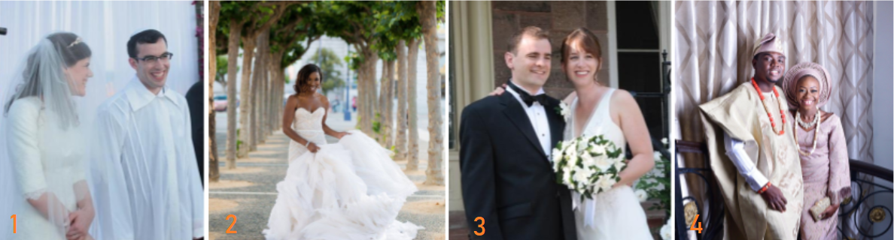
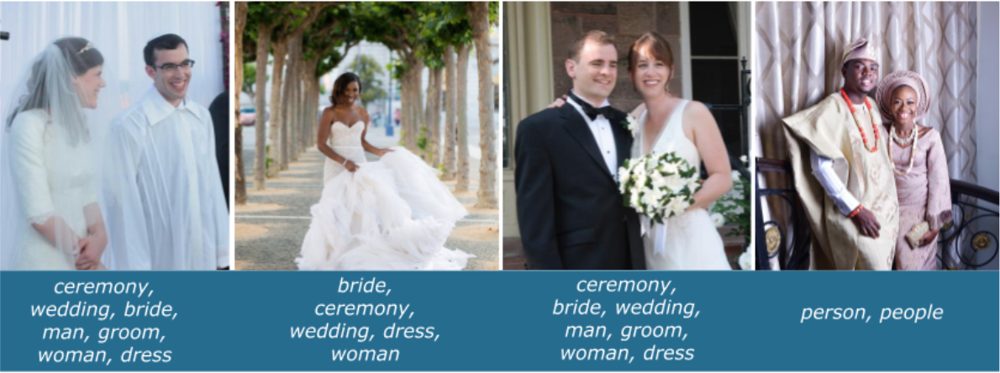

FIXME



## Bias in machine learning

Though AI and machine learning (ML) systems may appear to us as objective, dealing solely in facts and numbers, free from troublesome human proclivities in their decision making, there are abundant opportunities for human bias to enter ML systems at all stages of the pipeline. 

Human bias can have a broad and complex range of effects on the classification and predictions of models, with consequences of varying degrees. Bias in AI can be understood in most general terms as an error where incorrect assumptions lead to systematically prejudiced results.

When we typically hear about bias in AI these days, particularly in the news, it is most often presented and understood in the context of societal prejudice and discrimination, where human prejudice in the development and application of algorithms results in the perpetuation of unfairness, inequities, and stereotypes of the real world.

[Predictive policing systems](https://en.wikipedia.org/wiki/Predictive_policing) are a canonical illustration of this. Such systems are being relied upon as tools for courts to use in sentencing, aiming to predict the likelihood of defendants committing a future crime. Analysis by ProPublica in 2016 of one system used widely throughout the United States, Correctional Offender Management Profiling for Alternative Sanctions (COMPAS) tool, uncovered significant racial disparity between the system predictions for white and black defendants. The COMPAS tool assigns scores from 1 to 10 to a defendent based on 100 or so factors such as age, sex and criminal history (although notably race has been excluded). While overall, "Northpointe’s assessment tool correctly predicts recidivism 61 percent of the time...blacks are almost twice as likely as whites to be labeled a higher risk but not actually re-offend. It makes the opposite mistake among whites: They are much more likely than blacks to be labeled lower risk but go on to commit other crimes. (Source: [ProPublica analysis of data from Broward County, Fla.](https://www.propublica.org/article/machine-bias-risk-assessments-in-criminal-sentencing))". Interestingly, [a subsequent study](https://www.theatlantic.com/technology/archive/2018/01/equivant-compas-algorithm/550646/) has revealed that the COMPAS tool was actually no better at predicting crimes than random people on the internet.

Bias may exist in other forms, such as an image dataset that inadvertently contains objects that always happen to appear in the center of the image, making it hard for a classifier to recognise objects that are not in the center of images. 

Bias may even be introduced to an algorithm in order to correct an unfair model. Consider an image search algorithm, based on real world data where a majority of men are CEOs. A user searching for "CEO" will find images of primarily men, and a good bias may be introduced in order to insure proper representation of a diversity of CEOs. 

In whatever form it takes, and we'll cover more of these forms in this episode, it is crucial for model builders to be able to identify bias and manage it. 

>“Although neural networks might be said to write their own programs, they do so towards goals set by humans, using data collected for human purposes. If the data is skewed, even by accident, the computers will amplify injustice.” — The Guardian

>## Activity
>
> Consider this riddle: A father and son get in a car crash and are rushed to the hospital. The father dies. The boy is taken to the operating room and the surgeon says, “I can’t operate on this boy, because he’s my son.” How is this possible? 
>
>
> >## Solution
> >
> > The surgeon is a woman. 
> > In research conducted on 197 BU psychology students (where women outnumbered men two-to-one) and 103 children, ages 7 to 17, only a small minority of subjects—15 percent of the children and 14 percent of the BU students—came up with this answer. Of self-described feminists in the student group, a majority, 78 percent, did not guess the surgeon was the mother. This illustrates how a training dataset may unintentionally come to encode societal gender bias through human applied labels such as "Surgeon" vs. "Female Surgeon". 
> >
> > 
> {: .solution}
{: .challenge}

>## Note
>
> Data bias here is not to be confused with the ["bias term"](https://developers.google.com/machine-learning/glossary#bias-math) also used in machine learning or statistical terms such as [bias-variance trade-off](https://en.wikipedia.org/wiki/Bias%E2%80%93variance_tradeoff).
{: .callout}

## Common bias types in machine learning 

Let's take a closer look at some specific and common types of bias that may manifest in the undertaking of machine learning approaches at your institution. This is of course only a small handful of potential sources of bias that may affect our judgment and skew a model's predictions. It's important for model builders to be vigilant about finding and remedying bias in whatever form it may enter the machine learning pipeline.  

|Type|Definition|Example|
|----|----|----|
|Prejudice bias | Arises when data incorporates cultural, race, gender or stereotypes it should be ignorant of|A model is designed to differentiate between men and women in a museum’s photograph collection. The training data contains more pictures of women in kitchens than men in kitchens, or more pictures of men coding than women, then the algorithm is trained to make incorrect inferences about the gender of people engaged in those activities due to prejudices that occur in the real world, represented in the data.|
|Selection bias| Introduced by the selection of individuals, groups or data for analysis in such a way that proper randomization is not achieved, thereby ensuring that the sample obtained is not representative of the population intended to be analyzed | A model is trained to predict future sales of a new product line for the museum gift shop. To build the training set, the first 200 subscribers to the museum's newsletter were offered a small gift voucher to fill in a survey. Instead of randomly targeting consumers, the dataset targets newsletter subscribers who don't necessarily represent the museum's potential paying customers. It's entirely possible the newsletter subscribers population may be more inclined to be signed up to learn about free events and giveaways, while typical consumers may not be enticed by small gift vouchers or even signed up at all.|
|Confirmation bias| In the process of refining and reinforcing a models learning, unconsciously or consciously processing data in ways that confirm preexisting beliefs and hypotheses.|An engineer is building a model that predicts aggressiveness in dogs based on a variety of features (height, weight, breed, environment). The engineer had an unpleasant encounter with a hyperactive toy poodle as a child, and ever since has associated the breed with aggression. When the trained model predicted most toy poodles to be relatively docile, the engineer retrained the model several more times until it produced a result showing smaller poodles to be more violent.| 
|Correlation bias| Correlation is not causation. Correlation implies the mutual relation, covariation, or association between two or more variables. It only questions whether the variable varies together or not.|The height of the father and his children is correlated, but one can’t say that the father's height is caused by determining his children's height on the only assumption of the hereditary factor. There are several other factors present such as environment, genetics, etc.|
|Exclusion bias| Removing data from a set that we think isn’t relevant |For example, imagine you have a dataset of customer sales in America and Canada. 98% of the customers are from America, so you choose to delete the location data thinking it is irrelevant. However, this means your model will not pick up on the fact that your Canadian customers spend two times more.|

## When might human bias enter a machine learning pipeline?

There are abundant opportunities for human bias to enter ML systems at all stages of the pipeline including:

* When the study is being designed
* When datasets are constructed
* When decisions are being made to refine and reinforce a models learning 
* When interpreting and applying decisions made by the model to real world scenarios

### Bias arising in the study design

Some machine learning systems are quite simply built on ethically unsound foundations from the outset. A recent controversial study, [Tracking historical changes in trustworthiness using machine learning analyses of facial cues in paintings](https://www.inputmag.com/culture/this-algorithmic-study-about-trustworthiness-has-some-glaring-flaws), published in Nature Communications, garnered significant controversy for its proximity to the thoroughly debunked pseudoscience [phrenology](https://en.wikipedia.org/wiki/Phrenology) which aims to assess an individuals personality and (or in the case of this study, trust) based on facial structure. 

### Bias arising in dataset collection and construction

> "It’s all too easy to forget that data is about human beings and their behaviors. Data is not an abstraction...Data encodes the stories of our lives, capturing not only our tastes and interests but also our hopes and fears. Data isn’t an abstract idea or a set of numbers or qualitative responses. It can be and is, ultimately, human. (reference)"
> 

Data is never neutral. It is collected, managed, and organised by and about people. And the manner in which data is sourced and constructed for training sets will have important implications on your model's output. In the simplest example, if you are aiming to build a face recognition software but only train your model on a dataset of white faces, your model is obviously going to struggle to identify faces of any other colour. 

Because of the many complexities around copyright and licensing, privacy issues and high costs involved in getting access to large quantities of quality datasets, data scientists have favoured scraping what they can find freely, en masse and indiscriminately, across the internet from free sources such as [Wikipedia](https://aws.amazon.com/de/datasets/wikipedia-xml-data/), FlickR or Google News. Datasets collected in this manner, taken without intervention, will reflect the biases of these sources, such as a certain demographic composition (overrepresentation of young internet users from developed countries for example). 

When training data is labelled (annotated), typically through some kind of crowdsourcing mechanism such as Amazon’s Mechanical Turk, and as we saw in the first activity, bias can crop up, either consciously or unconsciously, in the course of this. Whether personally undertaking or crowdsourcing your data annotation, it’s important to be aware of how different demographics and social constructs may introduce bias and implicit associations into your pipeline.

GLAM staff will be more than familiar with this phenomenon as we grapple with [historical bias in library and archives descriptions](https://cataloginglab.org/list-of-statements-on-bias-in-library-and-archives-description/). As demand for GLAM collections and catalogue data for use in machine learning increases, it is vital that model builders are made aware of the biases that may be encoded within cultural heritage data.

>## Activity
>
> Consider this image and write a list of terms you would use to annotate it. Compare your outputs with your nearest neighbour(s). Discuss the differences and how this could effect a model. How might you mitigate these differences in annotations?
> 
>
> >## Explore Further
> >
> > 
> > The image comes from wedding photographs (donated by Googlers) for the [Open Images dataset](https://ai.googleblog.com/2018/09/introducing-inclusive-images-competition.html). How well did you do compared to a classifier's label predictions (recorded below each image). 
> >
> > 
> {: .solution}
{: .challenge}

### Bias arising when refining and reinforcing a models learning
 
We've talked a lot about bias that can make it into our training data, but this isn't the only way it manifests itself in machine learning systems. As we now know from earlier in this lesson, machine learning models are refined and reinforced based on reactions to its results. In this process, there is a risk of certain outcomes being ignored and others privileged over others, skewing a models learning.

For example, A model builder is using named entity recognition across multilingual newspapers. They might determine they are satisfied when the model gets to 90% accuracy and will aim to improve to this result. However this overall accuracy can hide the fact that some particular ‘slices’ of our data might have much worse accuracy. Your overall accuracy might be very good but your model may underperform on one language. This might not be addressed by changing your data but changing how you approach training and evaluating your model.

### Bias arising in the application of machine learning decisions to real world scenarios  

This may be an area you might already have some awareness of as the ubiquity of machine learning systems in our lives increases, the effects of unfair, biased algorithms are starting to become more apparent. Algorithmic bias is defined as unjust, unfair, or prejudicial treatment of people related to race, income, sexual orientation, religion, gender, and other characteristics historically associated with discrimination and marginalization, when and where they manifest in algorithmic systems and algorithmically aided decision-making. Predictive policing as covered earlier is probably the most clear example of algorithmic bias. #TODO: add Amazon hiring example. Another canonical example of this is the Amazon hiring 

It is imperative to be aware then that the manner in which data is collected, annotated and results applied, will have far reaching consequences for society as decisions produced by ML systems are increasingly being relied upon in real world scenarios. From seemingly benign systems like recommendation engines to predictive policing, opportunities for ML systems to perpetuate and amplify humans bias and inequality abound.  

## How can GLAM staff help manage bias in machine learning approaches?

> Archives are the longest standing communal effort to gather human information and archive scholars have already developed the language and procedures to address and discuss many challenges pertaining to data collection such as consent, power, inclusivity, transparency, and ethics & privacy. [Reference Lessons from archives: strategies for collecting sociocultural data in machine learning](https://dl.acm.org/doi/pdf/10.1145/3351095.3372829)
> 

The presence of bias in the classifications and predictions of machine learning is a key challenge today, but being aware of and transparent about the problem allows us to take proactive steps to mitigate their effects. For GLAM professionals, this is familiar ground and in [Reference Lessons from archives: strategies for collecting sociocultural data in machine learning](https://dl.acm.org/doi/pdf/10.1145/3351095.3372829) the authors argue that the document collection practices in archives present the ideal ethical and practical framework for mitigating bias in data collection for the field of machine learning. GLAM professionals have an opportunity to apply these tools to the management of bias.

“That means,” said Catanzaro, “that the collection and curation of data sets, the skills that you guys practice—the resources that you have access to—can enable the creation of new algorithms and new applications.”(Catanzaro, 2019, 5:30)

How else might GLAM staff actively help manage bias in machine learning approaches? 

* GLAM institutions must ensure a diverse workforce-monoculture cannot effectively manage bias-diversity is not an option, it is an imperative [(Responsible Operations: Data Science, Machine Learning, and AI in Libraries)](https://www.oclc.org/content/dam/research/publications/2019/oclcresearch-responsible-operations-data-science-machine-learning-ai-a4.pdf))
* Hold symposia focused on surfacing historic and contemporary approaches to managing bias with an explicit social and technical focusing on the challenges libraries faced in managing bias while adopting technologies like computation, the internet, and currently with data science, machine learning, and AI. 
* Contribute diverse language materials, collections and texts to sources where model builders are finding their data such as Wikipedia
* Collaborate directly with computer scientists to build new diverse, curated data sets for use in machine learning ([Arabic HTR](https://www.bl.uk/projects/arabic-htr)) 
* Enlist the help of staff with the right domain expertise to review training data construction before and after, they may see biases that you have overlooked
* When collecting and annotating data make sure to recruit diversified crowds for the task and carefully communicate instructions
* Employ toolkits for detecting and removing bias from machine learning models, for instance the IBM open sourced [AI fairness 360 tool](http://aif360.mybluemix.net/) 
* Consider your partnerships and collaborators closely, including ramifications of outsourcing your AI to external companies/partners
* Know your data and your model and be transparent about it. Create [Datasheets](https://arxiv.org/abs/1803.09010v3) and [Model cards](https://arxiv.org/abs/1810.03993) describing and documenting them in full for users 

>## Activity
>
> In small groups, consider the following potential machine learning project. Discuss 2-3 potential points at which bias may enter the pipeline, and questions/strategies GLAM staff might want to consider in order to manage it. 
> 
>
> >## Discuss
> >*A museum is keen to make a newly acquired digitised collection of 20,000 Southeast Asian late 19th century photographs more discoverable within the main catalogue. The photographs are the work of an English traveler, and aside from captions handwritten by him, the individual photographs have very little in the way of item level description. A model will be trained to help classify the photographs (places, people, events, objects) and the new machine generated descriptive tags added to the catalogue records. To create the training set from which the model will learn, a crowdsourcing project will bet set-up asking members of the public to add their own descriptive tags to a subset of the images.* 
> >
> > 
> {: .solution}
{: .challenge}

>## Resources Consulted & Recommended Reading
> - Barbosa, N., & Chen, M. (2021). Rehumanized Crowdsourcing. Proceedings of the 2019 CHI Conference on Human Factors in Computing Systems. Dl.acm.org. Retrieved 29 March 2021, from https://dl.acm.org/doi/10.1145/3290605.3300773. 
> - Barlow, R. (2014). BU Research: A Riddle Reveals Depth of Gender Bias. BU Today. Boston University. Retrieved 29 March 2021, from https://www.bu.edu/articles/2014/bu-research-riddle-reveals-the-depth-of-gender-bias.
> - Catanzaro, B. (2019, December 4). "Datasets make algorithms: how creating, curating, and distributing data creates modern AI." [Video file]. Retrieved from https://library.stanford.edu/projects/fantastic-futures.
> - Coleman, C. (2020). Managing Bias When Library Collections Become Data. International Journal Of Librarianship, 5(1), 8-19. https://doi.org/10.23974/ijol.2020.vol5.1.162.
> - Ekowo, M. (2016). Why Numbers can be Neutral but Data Can’t. New America. Retrieved 29 March 2021, from https://www.newamerica.org/education-policy/edcentral/numbers-can-neutral-data-cant/. 
> - Gebru, T., Morgenstern, J., Vecchione, B., Vaughan, J., Wallach, H., Daumeé III, H., & Crawford, K. (2020). Datasheets for Datasets. arXiv.org. Retrieved 29 March 2021, from https://arxiv.org/abs/1803.09010v3.
> - Hellström, T., Dignum, V., & Bensch, S. (2020). Bias in Machine Learning What is it Good (and Bad) for?. arXiv preprint. Retrieved 20 April 2021, from https://arxiv.org/abs/2004.00686v2.
> - Jo, E., & Gebru, T. (2020). Lessons from archives. Proceedings Of The 2020 Conference On Fairness, Accountability, And Transparency. https://doi.org/10.1145/3351095.3372829. 
> - Mayson, Sandra Gabriel, Bias In, Bias Out (2019). 128 Yale Law Journal 2218, University of Georgia School of Law Legal Studies Research Paper No. 2018-35, Available at SSRN: https://ssrn.com/abstract=3257004.
> - Padilla, T. (2019). Responsible Operations: Data Science, Machine Learning, and AI in Libraries. OCLC Research Position Paper. https://doi.org/10.25333/xk7z-9g97. 

{: .checklist }

