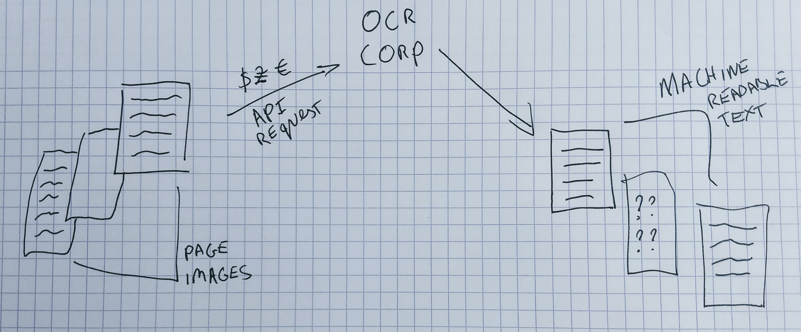

FIXME



## Episode Introduction

In this episode, we turn to the question of how we can apply machine learning in a GLAM setting.  We’ll move through the process of applying machine learning step-by-step to make these stages easier to follow. In reality, this process will rarely be completely linear and you likely need to iterate on many steps of the process. 

## Machine Learning projects 
A report has suggested that 85% of AI projects “ultimately fail to deliver on their intended promises to business”. Successfully applying machine learning in a GLAM setting involves a range of challenges including; data quality, identifying ethical concerns building or adapting machine learning models, internal and external communication. 

> ## What does failure mean in your institution
>
> What do you think is the most likely reason an ML project would ‘fail’ in your institution. What would ‘failing’ mean?
{: .discussion}

\ # TODO illustration of the overall steps of ml application pipeline?

## What is the "business" need?

There are many possible uses of Machine Learning in a GLAM context. These can range from projects with a relatively limited scope to ambitious “end-to-end” applications of Machine Learning across core infrastructure.

It is important that you have a clear idea of what your goal is in applying Machine Learning. This could be a relatively open-ended goal of ‘exploring what might be possible but sometimes you will have a much more concrete outcome you are hoping to achieve.

 Some example of business needs that could potentially be addressed using Machine Learning: 

| Type of use case                                                       | GLAM Example                                                                                                                                                                                                                                                                                                                                                                                                                                                                                     |
| ---------------------------------------------------------------------- | ------------------------------------------------------------------------------------------------------------------------------------------------------------------------------------------------------------------------------------------------------------------------------------------------------------------------------------------------------------------------------------------------------------------------------------------------------------------------------------------------ |
| Using Machine learning to help address an existing ‘problem’           | You use an external API service to produce OCR for digitised material in your collection. This service charges per image submitted. You know you are currently submitting many pages to this service where there is no text on the page. This means you are spending additional money on this service. The volume of images makes it hard to manually check for blank pages. Ideally, you want some kind of system that can filter out these images so they aren’t submitted to the OCR service. |
| Using Machine learning to enable new ways of working with a collection | Your institution has a large collection of digitised newspapers. Some of these newspapers included illustrations of various kinds. At the moment the only way these images can be found by browsing through images one at a time. You would love to be able to identify where these images are in the collection without having to look through millions of pages manually.                                                                                                                      |
| Using Machine learning to make connections                             | Your institution has a range of collections that have been digitised but don’t contain much metadata. You think that exposing some key information from unstructured text documents may help users search and explore these collections.                                                                                                                                                                                                                                                         |
| Using Machine learning to explore new research questions               | You have collections of materials that are too large to explore individually. You think that interesting trends might be found by exploring these collections at scale. You have previously used n-grams to explore the usage of words over time but you think that developments in Natural Language Processing using machine learning might enable new questions to be explored.                                                                                                                |

> ## Use cases for Machine Learning in your Organization
>
> - Where do you think ml could be used in your organization? 
> - Would machine learning be used to do something new or help with existing processes or systems?
{: .discussion}

## Predictions into actions

Machine learning models produce predictions. We can use these predictions in a variety of ways. How we use these predictions is a critical consideration when using Machine Learning. A “perfect” model could be useless if the predictions it makes are used in an inappropriate way and an “average” model might be beneficial if it is carefully used within other workflows.

Let’s look at an example to illustrate the predictions generated by a machine learning model can be used very differently. For our example, we’ll consider a machine learning model that takes some text as input and predicts the language of that text.  The predictions generated by this model could be used:

- To directly create metadata for the language field for an item.
- To show the language code as a suggestion to a human cataloguer who can choose to use or ignore the suggestion.
- To directly create the language code for a record if the model ‘confidence’ is above a certain level, and show it to a human cataloguer if the prediction falls below a confidence threshold.
- Show the predicted language and confidence score to the user of a public catalogue system with a button allowing the user to indicate if they think the prediction is correct or not. 

You can hopefully see from these examples that there are many potential ways to utilise the predictions made by a machine learning model. The way in which you decide to use the predictions of a model will depend on many factors; existing infrastructure, staff attitudes towards machine learning, user needs etc. 

> ## How might you use predictions?
>
> Going back to your potential ML use case - discuss how you would plan to use predictions of the model?
> Some potential questions to discuss:
> - would a human still be 'in-the-loop'?
> - would this introduce a new process, or modify an existing process?
> - who would get to see the 'raw' predictions?
> - would your users be directly exposed to the predictions made by your model?
{: .discussion}

## People and Skill 

You will need the right might mix of people and skills to successfully apply machine learning in a GLAM setting. 

> ## Identifying skills required for a machine learning project
>
> - What are some of the skills you think you might need for completing an Machine Learning project?  
> - Where might you find these skills in your organization?
>
> > ## Skills which are likely to be important
> >
> > - Domain expertise: it is important that people with intimate knowledge of the collections or ‘business’ need to be addressed are involved in the development of machine learning approaches. 
>> - Project management: to keep track of progress
>> - IT: if you are going to work with existing infrastructure you might need support from IT for things like the storage of data
>> - Communication skills: to communicate the goals of the project internally and potentially to external audiences
>> - Team working skills: it is likely that most machine learning projects done in a GLAM setting will be done as part of a team
> >
> {: .solution}
{: .challenge}

You will probably notice that there are many skills that are likely to be important for the success of a project beyond direct data science or coding skills. We will look more closely at these data science skills later in this episode. 

## Data 
As we saw in the previous episode data is of central importance for developing Machine Learning models. The process involved in preparing data for use in a machine learning project will depend on what you are trying to achieve, the kind of machine learning you want to use but there are some broad considerations that will apply in many situations. 

\ # TODO see where this data section fits in relation to the previous episodes 
?Maybe: Creating a smallish set for testing external methods
?Maybe: Creating a small test for the initial model training to establish feasibility 

## Choosing a metric to optimize 
\ # TODO possibly shorten/cut depending on previous episodes 
In earlier episodes metrics were introduced as a way of tracking model performance on a particular task. It is often recommended that machine learning projects should focus on a particular, single metric to optimize for. This will often be a certain accuracy score. If you are working with very imbalanced data where some labels appear more frequently you may choose another metric like f1-score instead. This decision will really depend on the ‘business’ need you are addressing. For example, if there will always be a ‘human in the loop’ you might accept a lower accuracy score compared to a use case where model predictions will be used directly. There may also be additional considerations in the real world that aren’t captured by a headline accuracy metric. This could include; how understandable your model’s predictions are, how quickly a model is able to make predictions and how easy a particular model is to implement. 

## Creating a baseline: could your machine learning model be a regular expression? 

When deciding between different machine learning models it is often useful to have a baseline that you can compare your results to. If you read literature around machine learning models you will see that performance is often reported on particular ‘benchmark’ datasets. The performance on one of these benchmark datasets won’t always transfer to other problems. 

Creating a baseline approach helps to set a level of performance a machine learning approach should be able to supersede. The most simple baseline is to create a model which does some variation on guessing. For example, you could assess the metrics you get when you make a prediction proportional to how much that label appears in the training data. For example, if you have a dataset that contains 70% of the image with the label ‘cat’ and 30% ‘dog’ your baseline model would guess ‘cat’ 70% of the time and ‘dog’ 30% of the time. 

You might go beyond this and see if you can use a ‘rules-based approach’ where you try and create a computer program that will make predictions based on rules. For example, you might be able to create a series of [regular expressions](https://en.wikipedia.org/wiki/Regular_expression) which matches particular text strings which you think are likely to indicate the presence of a particular label. Carrying out a baseline evaluation will give you a useful starting point of comparison and will also help you confirm whether machine learning is worth pursuing for your use case. 
 
## Adapting or creating Machine Learning models 
We are now at the point in the process where we begin creating a model. This is a vast topic which we can only scratch the surface of here. We will focus on two particularly important decisions: whether to use an existing model or to develop a new one for your task. 

## Using existing models
There are various ways in which you can leverage existing machine learning models. Some of these include using:

- machine learning models which are ‘deeply’ embedded into applications. For example tools for performing OCR will often include some machine learning-driven components. 
- machine-learning as an API service for example Google [Vision AI](https://cloud.google.com/vision/) that can be sent data and will return a prediction. 
- models which have been trained on a particular task and can be used ‘out-of-the-box to make new predictions. For example a Named Entity Recognition Python Library like [spaCy](https://spacy.io/).  

There are a number of considerations that might influence whether you use one of these systems. Some potential things to consider include; 

- Easy of use: how easy is it to use the system to generate predictions? Importantly how easy is it to use in your situation? For example, an API might be easy to use on paper but if your organization doesn’t want data to leave local storage this option will be less suitable. 
- Differences between models original training data and your data: the training data used to train these existing models might be different from your data. For example, a Named Entity Recognition tool might have been trained on contemporary French, but you are planning to use it with 19th Century French. This may impact how well the model performs on your data. 
- Cost: how much does the tool cost to use? Some of these existing models are open source but there will still be costs involved in applying these tools. Other tools may charge per prediction. 
- How much can you integrate the model: some of these tools will be fully open-source with the developers happy to answer questions about the models. Others are prosperity and it will sometimes be difficult to know much about how the model was trained and where the model will do less well. 

Having a small test set to work with will help make the process of evaluating these options easier. It is also worth reaching out to other institutions to build on existing lessons learned. We’ll outline some resources for doing this in a future episode. 

## Developing new models 
\ # TODO updates to this section based on what is already covered in other parts. Can probably drop quite a bit from this section. 

An alternative to using existing models is to train your own models. There are different ways of doing this:

‘Finetuning’ an existing model: this involves updating a previously trained model with your data. For example, updating a Named Entity Recognition model trained on modern French with training data for 19th Century French. 
Training an existing model architecture from scratch: ?? 
Custom task architectures: ??

## Using machine learning models 

Once you have a machine learning model you are satisfied with you will want to set up some way of using this model to create new predictions on unseen data - usually, this is referred to as inference. The processes behind making a model available for inference is often referred to as ‘deployment. 

It is beyond the scope of this workshop to cover all of the considerations involved in this process. There is also a growing number of tools and guidance related to deploying machine learning models that can be drawn upon. There are some questions you should consider as you think about:

- The user(s) of a model: who is going to be interacting with a model? 
- Where is the data: where is the data you want to make predictions on, is it easy/possible to move this or is it easier to bring the model to the data?
- Existing workflows: where does this model ‘sit’ within existing workflows within your institutions? It might be easier to try to fit your model within this workflow rather than introducing a new machine learning approach at the same time as changing an existing workflow. 
- Existing IT infrastructure: what is a realistic approach to using a model inside your existing infrastructure? A lot of the guidance on deployment takes for granted that you have access to a cloud service but this will not be the case for all GLAM institutions. 

## Monitoring your model 

Now you have created a model and have some way of using it you may be hoping that the journey is over. However, if you plan to continue to use your model there are certain things that are important to watch out for. 

**Safety checks:** You may want to perform some ‘safety checks’ on your model’s predictions. This may be particularly important if you use a pre-trained model where you didn’t have as much control over the possible labels a model chooses. Some labels which might be benign in some situations can become offensive when attached to inappropriate items. For example, if you have an archive that includes wartime photographs a picture of a bomb explosion might be labelled as ‘fireworks’ or ‘celebration’ by a computer vision model. These safety checks are particularly important when the material is sensitive and is another reason why it is important to have a team that thinks critically about these issues. 

**Data Drift**: A particularly important challenge you may potentially face is ‘data drift’. As we saw in previous episodes the data a model is trained on has a big impact on the predictions made by that model. Over time the data we ask our model to make predictions for may change from the data we originally used to train the model. This can lead to the predictions of your model becoming less accurate over time. 

> ## An example of data drift
>
>You trained a model to predict how many ‘no-shows' you get each hour for prebooked exhibitions to your museums. You use this model to help you decide how many extra tickets you can sell at the door. At some point, your model’s predictions are often wrong and you are frequently overcapacity in the exhibition space. 
>
> After a few days of trying to dig into what is happening, you realise that your museum now has a mobile app it didn’t previously have. This ap is being used by many people to buy tickets a few minutes before the exhibition to avoid queuing. Digging into the data you can see that currently the average time a ticket is purchased before a timed exhibition visit is an hour. Looking back at your original training data the average time was 3 days before. The models training data is different from the ‘real world’ in which we ask the model to make predictions. In this case, the change was quite obvious but you could think of other changes which could impact this model, the season in which the training data came from, the price of exhibition tickets etc. 
{: .callout}

**Monitoring predictions**: if you plan to use your model on an ongoing basis it may be helpful to monitor the predictions it makes. If you notice a big shift in the distribution of labels being predicted over time you may want to investigate if this is because of a change in the data being shown to the model. This may not always be possible to do automatically. So sometimes human checks may be more practical. 

**Keeping a human in the loop**: In an earlier section, we discussed how the predictions made by machine learning models could be used in a variety of ways. Some of these involved a human checking or using the model’s prediction. This approach will be likely to help you spot issues with models predictions. Even if you are using the model’s predictions to make automated changes you may still want to ‘insert a human into the loop to check these predictions fairly regularly. This may also be an important stage in developing buy-in for machine learning based approaches within an institution.

**Retraining a model**: in some situations a model won’t just be trained once. You may want to retrain the model when the type of data changes or you have more training data that can be used. One typical example of this kind of process is models which predict some metrics for each quarter. After that quarter has passed you will have ‘groud truth’ data available that you will likely want to use in your model. Another source of training data might be generated by having a human in the loop. If a model is showing predictions to a human who can accept or reject these predictions this gives you additional examples your model can learn from.

## Sharing what you have developed/learned 
\ # TODO section on sharing models, data, processes etc. 

**Training Data** 
\ # TODO possibly chop if covered elsewhere 
  - **Why?**:
    - Training data is time-consuming to produce and others may be able to reuse or build on your data
    - Being able to interrogate the data used to train a model may help give insights into the limitations of any models based on this data
    - Having shared datasets makes it easier for people to establish what is reasonable performance to expect for a particular model/task because they can compare results. 
  - **Possible approach?**
    - Share in an existing data repository
    - Include a clear license to indicate terms of use
    - Include documentation about how the dataset was constructed. [*Datasheets for datasets*](https://arxiv.org/abs/1803.09010f) offers a useful template for approaching this documentation.  

**Models**
  - **Why?**
    - It is likely that a lot of work went into creating this model and it is possible others could also benefit from this model 
    - Training some machine learning models has a large environmental impact. Sharing models can help this environmental cost being occurred multiple times.  
  - **Possible approach?**
    - Depending on how you are using your model’s predictions the model itself might be contained inside an ‘application’. This application could be shared directly or you might decide to share the model weights. 
    - It is important to document your model. The original intended use, limitations and a link to the training data will all help enabel people to evaluate how they could use your model. [*Model Cards for Model Reporting*](https://arxiv.org/ct?url=https%3A%2F%2Fdx.doi.org%2F10.1145%2F3287560.3287596&v=b782538f) provides guidance for what this documentation should include. 

**Processes, successes and failures** beyond sharing the more tangible outcomes of a machine learning project documenting the broader project will help other GLAM institutions apply machine learning. This documentation could include;
- The problem you were trying to solve
- Alternatives to machine learning considered
- How you created your training data
- The metrics which were important to you
- The models you considered
- The experiments you ran and the results of those experiments

There are various ways in which this work can be documented. Academic papers are a possible avenue for sharing the results of experiments but should not be considered as the ‘sole’ medium for sharing meaningful work. The format of many academic journals is likely to preclude sharing ‘failed’ projects and it may be challenging to publish more ‘modest’ uses of machine learning because they are deemed to lack ‘novelty’.

Beyond academic papers, there are a growing number of tools for managing machine learning projects which include data versioning, experiment tracking and other features for documenting work. Public version control repository like GitHub or GitLab offer venus for sharing code and you may explore using other tools like Jupyter notebooks to help make your models more accessible to others. 
